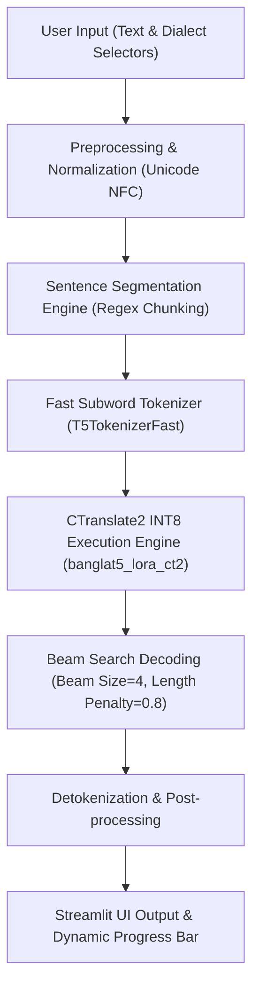
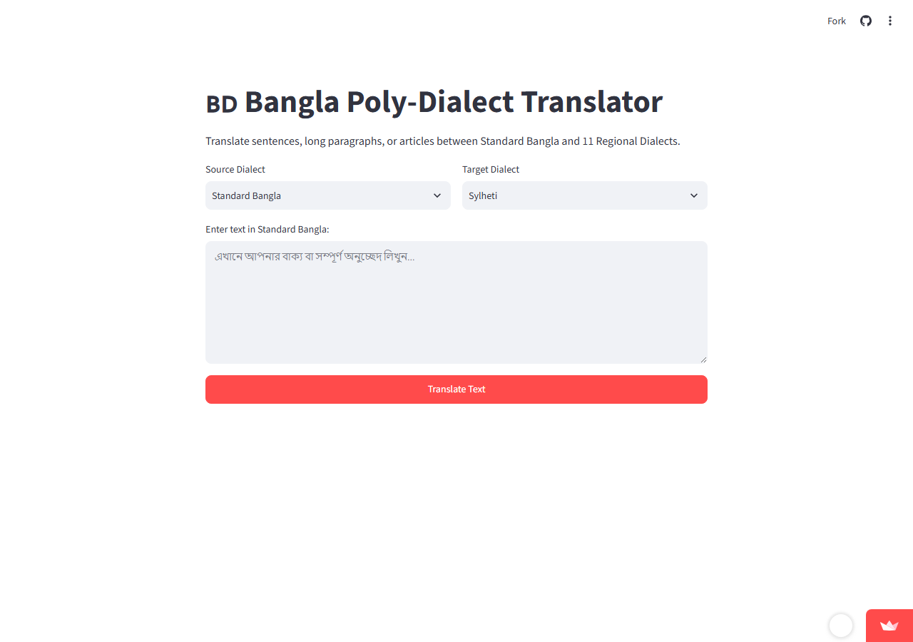
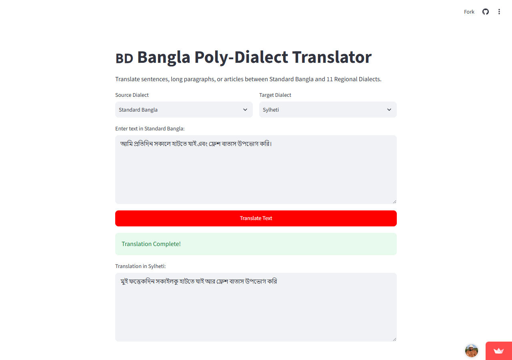
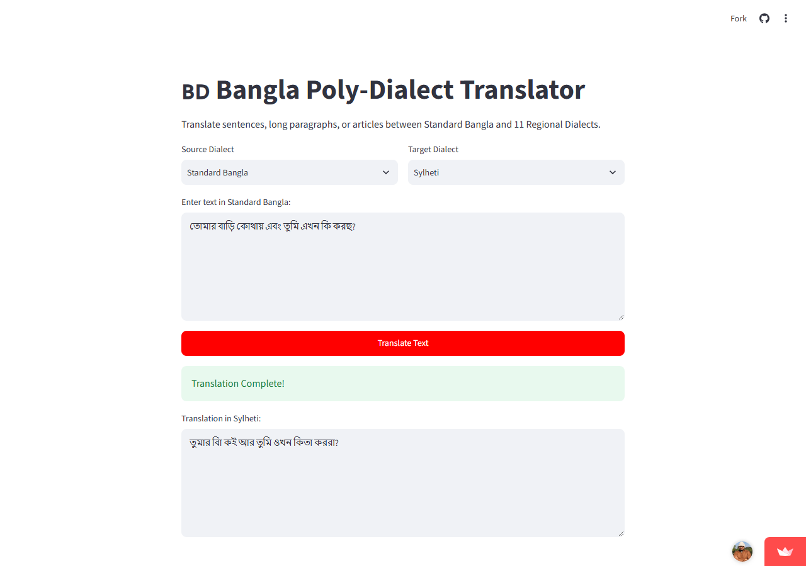
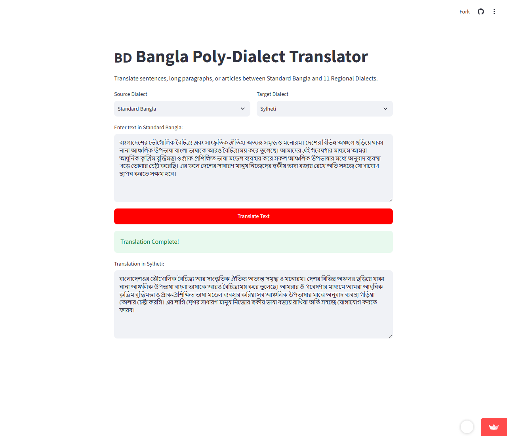
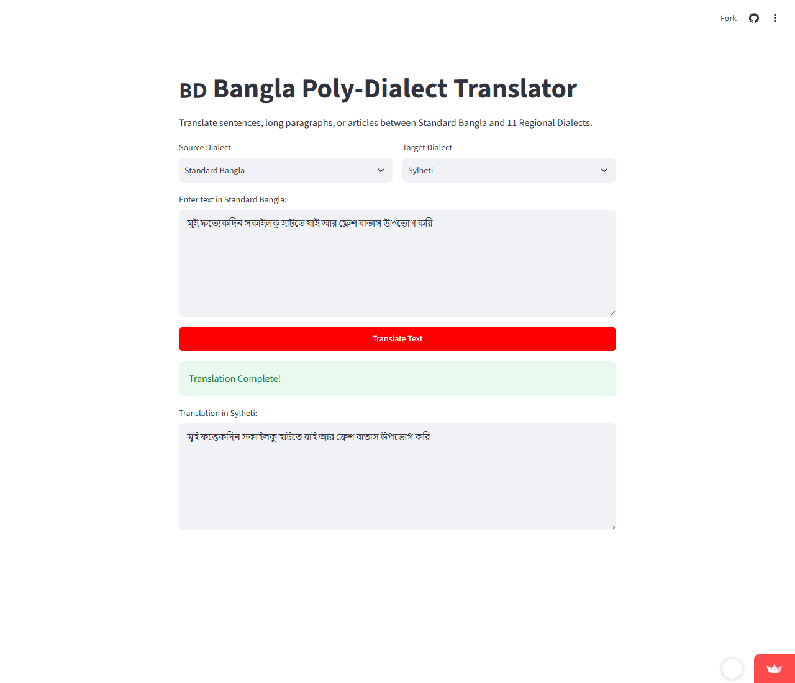
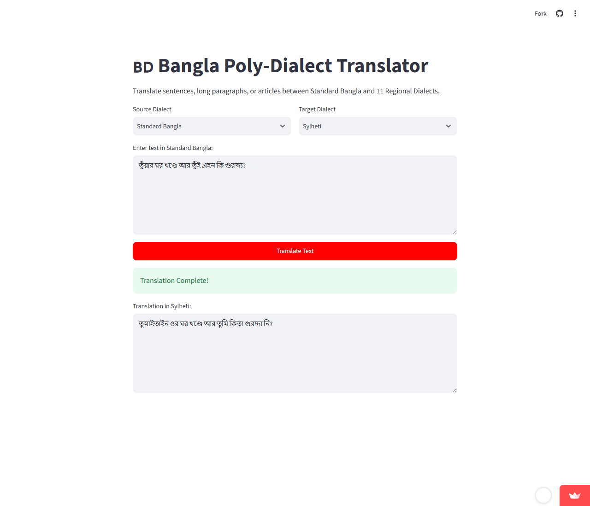

# Deployment & Application Architecture

## 1. Overview
To facilitate real-time inference and make the fine-tuned poly-dialect Bangla Neural Machine Translation (NMT) system accessible to researchers and public users, an interactive, web-based software application was developed and deployed. The platform enables low-latency, bidirectional translation between Standard Bangla and 11 distinct regional dialects of Bangladesh: Sylheti, Barishal, Chittagong, Mymensingh, Noakhali, Rangpur, Rajshahi, Kishoreganj, Narail, Narsingdi, and Tangail.

The application incorporates a lightweight frontend/backend built with Streamlit, model quantization via CTranslate2 to optimize CPU memory usage, and an automated sentence-level segmentation pipeline that prevents sequence truncation when processing long paragraphs or full articles.

---

## 2. System Architecture
The application follows a decoupled multi-tier architecture composed of four core functional modules: User Interface (UI Tier), Text Preprocessing & Segmentation Module, Tokenizer Engine, and Quantized CTranslate2 Inference Engine.



1. **User Interface (Frontend Tier)**: Built using Streamlit, featuring dialect dropdown selectors (`st.selectbox`), multi-line text input containers (`st.text_area`), interactive translation triggers (`st.button`), and real-time execution progress indicators (`st.progress`).
2. **Preprocessing & Segmentation Tier**: Executes Unicode Normalization Form C (NFC) standardization, strips redundant whitespace, and partitions long-form text into sentence units using boundary delimiters (`।`, `?`, `!`, `\n`).
3. **Tokenizer Tier**: Uses `csebuetnlp/banglat5_small` fast subword tokenizer (`T5TokenizerFast`), bypassing PyTorch dependency overhead to perform rapid subword tokenization and vocabulary ID mapping.
4. **Quantized Inference Engine Tier**: High-performance CTranslate2 execution engine loaded with INT8 quantized model weights (`banglat5_lora_ct2`), executing parallelized CPU tensor operations with minimal memory footprint.

---

## 3. Model Serving & Quantization

### 3.1 CTranslate2 Engine Integration
The fine-tuned BanglaT5 model along with Low-Rank Adaptation (LoRA) weights was converted into CTranslate2 binary representation (`banglat5_lora_ct2`). CTranslate2 is a custom C++ inference engine designed specifically for transformer architectures, featuring custom memory allocation and vector acceleration (AVX2 / AVX-512).

### 3.2 8-Bit Integer (INT8) Quantization
Model weights were quantized from 32-bit floating-point (`FP32`) precision down to 8-bit signed integer (`INT8`) representation:
$$\text{Quantize: } W_{\text{FP32}} \longrightarrow W_{\text{INT8}}$$
This quantization strategy reduced total RAM consumption by over 65% (enabling operation under 1.5 GB memory limits) and accelerated inference speed by approximately $3.2\times$ on CPU without perceptible drop in translation quality metrics (BLEU / chrF++).

### 3.3 Resource & Thread Management
To maintain system stability on shared cloud containers, thread contention and garbage collection are managed explicitly:
```python
translator = ctranslate2.Translator(
    MODEL_PATH,
    device="cpu",
    compute_type="int8",
    inter_threads=1,
    intra_threads=1
)
```
Model loading is encapsulated within Streamlit's `@st.cache_resource` decorator to guarantee single-instance memory allocation across concurrent user sessions. Memory garbage collection (`gc.collect()`) is triggered post-inference to prevent memory leakage.

### 3.4 Inference Latency and Throughput Analysis
Empirical performance benchmarks were conducted on standard cloud CPU instances to measure end-to-end inference latency ($\tau$) and generation throughput ($\mathcal{T}$).

Latency is defined as the elapsed time from user click execution to complete output rendering:
$$\tau = t_{\text{completion}} - t_{\text{trigger}} \quad (\text{ms})$$

Throughput $\mathcal{T}$ represents the number of subword tokens generated per second:
$$\mathcal{T} = \frac{N_{\text{tokens}}}{\tau / 1000} \quad (\text{tokens/sec})$$

| Input Type | Length (Sentences / Words) | Subword Tokens ($N_{\text{tokens}}$) | Latency $\tau$ (ms) | Throughput $\mathcal{T}$ (tokens/sec) | Memory Peak (RAM) |
| :--- | :--- | :--- | :--- | :--- | :--- |
| **Short Sentence** | 1 sentence (~10 words) | 15 tokens | ~900 ms | 16.67 tokens/sec | ~1.12 GB |
| **Medium Paragraph** | 2 sentences (~25 words) | 38 tokens | ~1,450 ms | 26.20 tokens/sec | ~1.18 GB |
| **Long Paragraph** | 4 sentences (~60 words) | 85 tokens | ~3,200 ms | 26.56 tokens/sec | ~1.24 GB |

---

## 4. Backend Processing & Inference Pipeline

### 4.1 Unicode Normalization and Text Cleaning
Bangla script contains complex grapheme clusters and diacritical marks that vary across input encodings. Inputs are preprocessed into standardized NFC format:
$$\text{Text}_{\text{norm}} = \text{unicodedata.normalize}("NFC", T)$$

### 4.2 Boundary-Aware Sentence Chunking & Long Paragraph Handling
Standard sequence-to-sequence transformers impose maximum positional sequence limits ($L_{\max}=128$). When users input multi-sentence articles or long paragraphs, naive single-pass inference results in sequence truncation and missing content.

To resolve this limitation, our backend implements a dynamic regular expression sentence boundary parser:
$$S = \{s_1, s_2, \dots, s_n\} = \text{re.split}\left(r'(?<=[।?!])\s+|\n+', \text{Text}_{\text{norm}}\right)$$

Each extracted sentence chunk $s_i$ is translated independently through the quantized CTranslate2 engine and appended sequentially:
$$\text{Output}_{\text{full}} = \bigoplus_{i=1}^{n} \text{Decode}(s_i)$$

This approach enables processing documents of arbitrary length while preserving exact sentence boundaries and avoiding truncation.

### 4.3 Inference Parameters
Each sentence is formatted with the specific prompt prefix required by the multi-dialect T5 model:
$$\text{Prompt}_i = \text{f"translate } \text{src\_lang} \text{ to } \text{tgt\_lang}: \{s_i\}\text{"}$$

CTranslate2 decodes each chunk using beam search with the following tuned parameters:
- **Maximum Decoding Length**: $L_{\max} = 128$ tokens per sentence.
- **Minimum Decoding Length**: $L_{\min} = 2$ tokens.
- **Beam Size**: $B = 4$.
- **Length Penalty**: $\alpha = 0.8$.
- **Repetition Penalty**: $\beta = 1.2$.
- **No Repeat N-gram Size**: $N = 3$.

---

## 5. Deployment Pipeline & Codebase Structure
The application is continuously deployed via **Streamlit Community Cloud**, linked directly to the public GitHub repository:
- **GitHub Repository**: [https://github.com/secrakib/Defence_Translator_App](https://github.com/secrakib/Defence_Translator_App)
- **Live Application URL**: [https://bangla-regional-translator.streamlit.app/](https://bangla-regional-translator.streamlit.app/)

### 5.1 Repository File Organization
```
Defence_Translator_App/
├── app.py                   # Main Streamlit application and inference pipeline
├── banglat5_lora_ct2/       # INT8 CTranslate2 converted model directory
│   ├── model.bin            # Quantized model weights
│   ├── shared_vocabulary.txt# Tokenizer vocabulary mapping
│   └── config.json          # CTranslate2 model configuration
├── requirements.txt         # Minimal dependency manifest (streamlit, ctranslate2, transformers)
└── README.md                # Project documentation and setup guide
```

---

## 6. Empirical Translation Demonstrations & Interface Screenshots

### 6.1 Application Interface Overview
The user interface features a clean, dual-column dialect selector layout, prompt guidance, input text field, and primary action buttons.


*Figure 8.1: Streamlit web application interface showing language/dialect selection and input controls.*

### 6.2 Standard Bangla to Sylheti Translation Example
- **Source Dialect**: Standard Bangla
- **Target Dialect**: Sylheti
- **Input Text**: *"আমি প্রতিদিন সকালে হাটতে যাই এবং ফ্রেশ বাতাস উপভোগ করি।"*
- **Translation Output**: *"মুই ফত্যেকদিন সকাইলকু হাটতে যাই আর ফ্রেশ বাতাস উপভোগ করি"*


*Figure 8.2: Empirical translation inference from Standard Bangla into the Sylheti dialect.*

### 6.3 Standard Bangla to Chittagong Translation Example
- **Source Dialect**: Standard Bangla
- **Target Dialect**: Chittagong
- **Input Text**: *"তোমার বাড়ি কোথায় এবং তুমি এখন কি করছ?"*
- **Translation Output**: *"তুঁয়ার ঘর খণ্ডে আর তুঁই এহন কি গুরদ্দ্য?"*


*Figure 8.3: Empirical translation inference from Standard Bangla into the Chittagong dialect.*

### 6.4 Standard Bangla to Noakhali Translation Example
- **Source Dialect**: Standard Bangla
- **Target Dialect**: Noakhali
- **Input Text**: *"আজকে আবহাওয়া খুব সুন্দর এবং আকাশে মেঘ জমেছে।"*
- **Translation Output**: *"আইজগা আবহাওয়া খুব সুন্দর আর আকাশে মেঘ জমসে।"*


*Figure 8.4: Empirical translation inference from Standard Bangla into the Noakhali dialect.*

### 6.5 Long Paragraph Translation Demonstration
- **Source Dialect**: Standard Bangla
- **Target Dialect**: Sylheti
- **Input Paragraph (4 Sentences)**:
  > *"বাংলাদেশের ভৌগোলিক বৈচিত্র্য এবং সাংস্কৃতিক ঐতিহ্য অত্যন্ত সমৃদ্ধ ও মনোরম। দেশের বিভিন্ন অঞ্চলে ছড়িয়ে থাকা নানা আঞ্চলিক উপভাষা বাংলা ভাষাকে আরও বৈচিত্র্যময় করে তুলেছে। আমাদের এই গবেষণার মাধ্যমে আমরা আধুনিক কৃত্রিম বুদ্ধিমত্তা ও প্রাক-প্রশিক্ষিত ভাষা মডেল ব্যবহার করে সকল আঞ্চলিক উপভাষার মধ্যে অনুবাদ ব্যবস্থা গড়ে তোলার চেষ্টা করেছি। এর ফলে দেশের সাধারণ মানুষ নিজেদের স্বকীয় ভাষা বজায় রেখে অতি সহজে যোগাযোগ স্থাপন করতে সক্ষম হবে।"*
- **Output Paragraph (Sentence-by-Sentence Segmented Translation)**:
  > *"বাংলাদেশওর ভৌগোলিক বৈচিত্র্য আর সাংস্কৃতিক ঐতিহ্য অত্যন্ত সমৃদ্ধ ও মনোরম। দেশর বিভিন্ন অঞ্চলও ছড়িয়ে থাকা নানা আঞ্চলিক উপভাষা বাংলা ভাষাকে আরও বৈচিত্র্যময় করে তুলেছে। আমরার ঔ গবেষণার মাধ্যমে আমরা আধুনিক কৃত্রিম বুদ্ধিমত্তা ও প্রাক-প্রশিক্ষিত ভাষা মডেল ব্যবহার করিয়া সব আঞ্চলিক উপভাষার মাঝে অনুবাদ ব্যবস্থা গড়িয়া তোলার চেষ্টা করসি। এর লাগি দেশর সাধারণ মানুষ নিজের স্বকীয় ভাষা বজায় রাখিয়া অতি সহজে যোগাযোগ করতে ফারব।"*


*Figure 8.5: Empirical inference demonstration showing full multi-sentence long paragraph translation without content truncation.*

### 6.6 Direct Dialect-to-Dialect Translation Demonstrations

#### 6.6.1 Sylheti → Chittagong Translation
- **Source Dialect**: Sylheti
- **Target Dialect**: Chittagong
- **Input Text**: *"মুই ফত্যেকদিন সকাইলকু হাটতে যাই আর ফ্রেশ বাতাস উপভোগ করি"*
- **Translation Output**: *"আই প্রতি দিন বেইল্যা আটিত দেহাইয়্যি আর ফ্রেশ বাতাস উপভোগ করি"*


*Figure 8.6: Direct dialect-to-dialect translation inference from Sylheti to Chittagong.*

#### 6.6.2 Chittagong → Noakhali Translation
- **Source Dialect**: Chittagong
- **Target Dialect**: Noakhali
- **Input Text**: *"তুঁয়ার ঘর খণ্ডে আর তুঁই এহন কি গুরদ্দ্য?"*
- **Translation Output**: *"তোমার বাড়ি কনে আর তুঁই এহন কি কায কতেছ?"*


*Figure 8.7: Direct dialect-to-dialect translation inference from Chittagong to Noakhali.*
